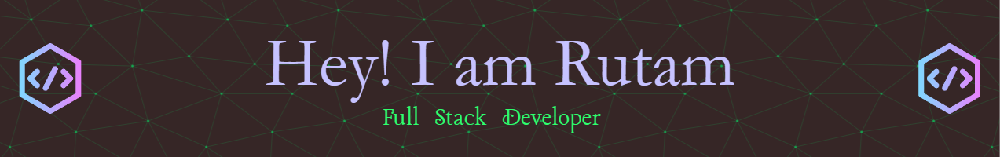

## Software Developer | Blogger | Open Source Enthusiast

- Full-stack Developer with a knack for building impactful solutions
- Expertise in HTML, CSS, JavaScript, Node.js, and MindsDB
- Cloud enthusiast (AWS, Google Cloud) for efficient deployments
- Dedicated to writing clean code and implementing best practices
- Active in the open-source community and Hackathons
 
### 𝕷𝖊𝖙'𝖘 𝖈𝖔𝖓𝖓𝖊𝖈𝖙 𝖆𝖓𝖉 𝖈𝖔𝖑𝖑𝖆𝖇𝖔𝖗𝖆𝖙𝖊 𝖔𝖓 𝖆 𝖊𝖝𝖈𝖎𝖙𝖎𝖓𝖌 𝖕𝖗𝖔𝖏𝖊𝖈𝖙!

 

### Connect with me

  
  

  

### Languages and Tools
 
<table><tr><td valign="top" width="33%">

### Frontend  

  
  
  
  
  
  
  
  

</td><td valign="top" width="33%">

### Backend  

  
  
  
  
  
  
  
  
  
  
  

</td><td valign="top" width="33%">

### DevOps  

  
  
  
  
  
  
  
  

</td></tr></table>  

 

# Blog posts
<!-- BLOG-POST-LIST:START -->
- [Deploying DocsGPT on DigitalOcean Droplet](https://dev.to/rutamhere/deploying-docsgpt-on-digitalocean-droplet-50ea)
- [Database GitOps with Bytebase for MySQL](https://dev.to/rutamhere/database-gitops-with-bytebase-for-mysql-45b3)
- [Database GitOps with Bytebase for PostgreSQL](https://dev.to/rutamhere/database-gitops-with-bytebase-for-postgresql-104h)
- [Building an Instill AI Pipeline in 5 minutes](https://dev.to/rutamhere/building-an-instill-ai-pipeline-in-5-minutes-4fp2)
- [Deploying DocsGPT on Civo Compute](https://dev.to/rutamhere/deploying-docsgpt-on-civo-compute-c)
<!-- BLOG-POST-LIST:END -->

 

### GitHub Trophy 🏆

### GitHub Stats

 

<h3>Recent GitHub Activity</h3>

<!--START_SECTION:activity-->
1. 💪 Opened PR [#39](https://github.com/Rutam21/k6-docs/pull/39) in [Rutam21/k6-docs](https://github.com/Rutam21/k6-docs)
2. 💪 Opened PR [#39](https://github.com/Rutam21/earthly/pull/39) in [Rutam21/earthly](https://github.com/Rutam21/earthly)
<!--END_SECTION:activity-->

<h3>Open Source Achievements</h3>

  

  
